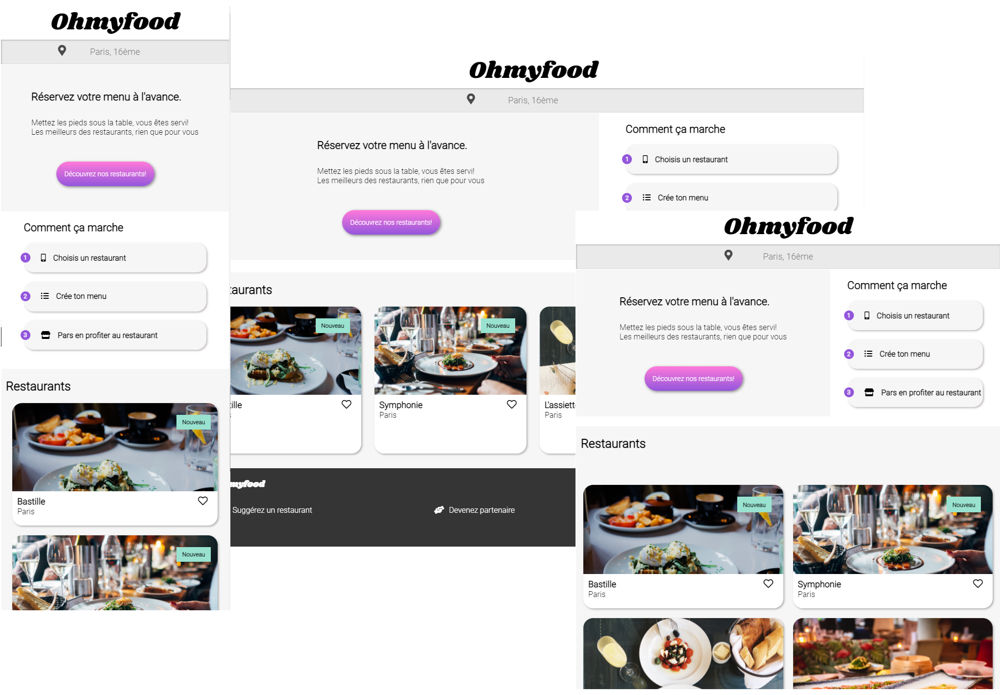

# PROJET 3 - Intégrer une maquette avec des animations CSS

Troisième projet réalisé dans le cadre du parcours Développeur web chez Openclassrooms.

Il s'agit d'un site mobile-first, responsive tablette et desktop, qui répertorie les menus de restaurants gastronomiques. En plus des systèmes classiques de réservation, les clients pourront composer le menu de leur repas pour que les plats soient prêts à leur arrivée.

## Technologies

- HTML
- CSS 
- SASS

## Animations 

### Boutons

- Au survol, la couleur de fond des boutons principaux s’éclaircit légèrement. L’ombre portée est également plus visible.
- À terme, les visiteurs pourront sauvegarder leurs menus préférés. Pour ça, un bouton "J’aime" en forme de cœur est présent sur la maquette. Au survol, il se remplit progressivement.

### Page d’accueil

- Un “loading spinner” apparaît pendant 1 à 3 secondes quand on arrive sur la page d'accueil.

### Pages de menu

- À l’arrivée sur la page, les plats apparaissent progressivement avec un léger décalage dans le temps. 
- Le visiteur peut ajouter les plats qu'il souhaite à sa commande en cliquant dessus. Cela fait apparaître une petite coche à droite du plat. Cette coche  coulisse de la droite vers la gauche. L’effet apparait au survol. 

